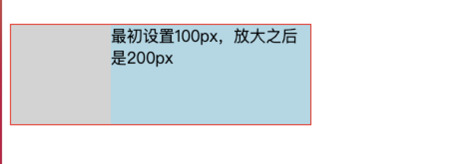

# Flex

术语定义：
flex父容器： 设置display: flex的容器
flex子元素： flex容器内的子项

## flex项目的自动最小尺寸

### 问题现象

当flex子元素的宽度过大，超出flex父容器宽度时；
给flex子元素设置`flex: 1`并不能限制flex子元素的尺寸，使其缩放


问题常出现在左右布局的flex容器内，某一边宽度固定，另一边文本溢出省略。

### 问题原因

> Automatic Minimum Size of Flex Items
> To provide a more reasonable default minimum size for flex items, the used value of a main axis automatic minimum size on a flex item that is not a scroll container is a content-based minimum size; for scroll containers the automatic minimum size is zero, as usual.

非滚动容器`非scroll container`:  基于内容的最小尺寸，也就是按照内容来展示

+ `overflow: visible` [默认值]
+ `overflow: clip`

滚动容器`scroll container`: 最小尺寸是 `0`

+ `overflow: hidden`
+ `overflow: scroll`
+ `overflow: auto`

所以在，默认情况下，`flex项目(非滚动容器)在主轴方向的尺寸，不能小于它内容的尺寸`

flex项目的`min-width: auto`、`min-height: auto` 就是基于内容展示

这个配置导致项目的尺寸不会小于自身内容的尺寸，
然后在此基础上，再应用flex-grow/flex-shrink规则进行缩放。


**可以通过以下方式覆盖**

+ `min-width: 0`
+ `min-height: 0`
+ `overflow: hidden` 或者是其他除了visible、clip的任意值
  + 因为加上这个设置之后，会使容器变成滚动容器，滚动容器的`min-width`、`min-height`设置为0

#### 延伸

`flex: 1`
`flex-grow: 1` 放大系数
`flex-shrink: 1` 缩小系数

flex 伸缩容器的含义

前提条件是: `flex项目的子元素宽度没有超过它自身的宽度`
> 自身的宽度指代： **放大后的宽度**

当**所有flex项目的总宽度小于flex父容器的宽度**时， **剩余的尺寸**，会根据`flex-grow`的设置，按比例分配给各个flex项目，是各个项目放大以填充满flex父容器



当**flex项目的总宽度大于flex父容器的宽度**时，**超出的尺寸**， 会根据`flex-shrink`的设置，按比例分配给各个flex项目，使各个flex项目缩小以填充flex父容器


当`flex项目的子元素宽度超过了它自身所能分配到的宽度`时，`flex项目就不会应用弹性伸缩`了


## flex布局容器高度/宽度问题

```html
<div class="container">
  
</div>

```

