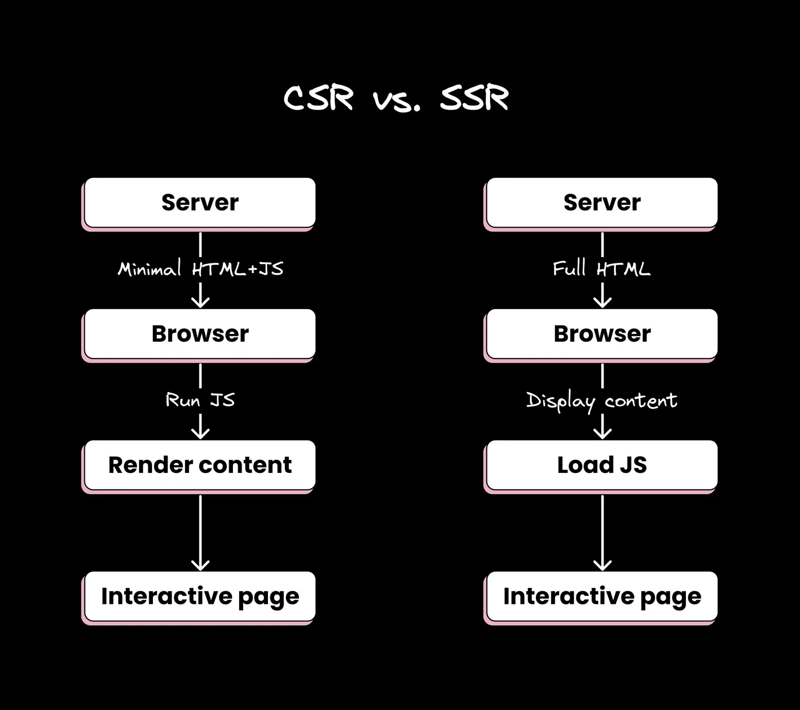

# SSR

Server-side Rendering
服务端渲染

## 关键

1. 用户请求web页面时，服务器直接返回 `fully rendered pages`
   + 完全的dom结构
   + 所有文本内容
   + 图片标签和其他媒体标签
   + 初始化styles

2. `客户端水合过程`
   + 在第一步的基础上，加载js并且执行
   + 根据js执行结果，完善dom结构，并增加交互行为

也就是首次访问网页，返回的内容，是直接能够供浏览器渲染首屏内容

## 优点

1. 更快的首屏渲染，避免首屏白屏问题
2. 更好的seo
3. 对读屏软件或者其他辅助技术友好
4. 兜底效果好，即使js加载失败，页面也有实质内容展示
  
## 缺点

1. 需要额外的开发适配
2. 需要更多的服务器资源， 因为有一部分逻辑是在服务端完成

## 选型考虑因素

1. seo需求
2. 加载时间要求
3. 服务器资源
