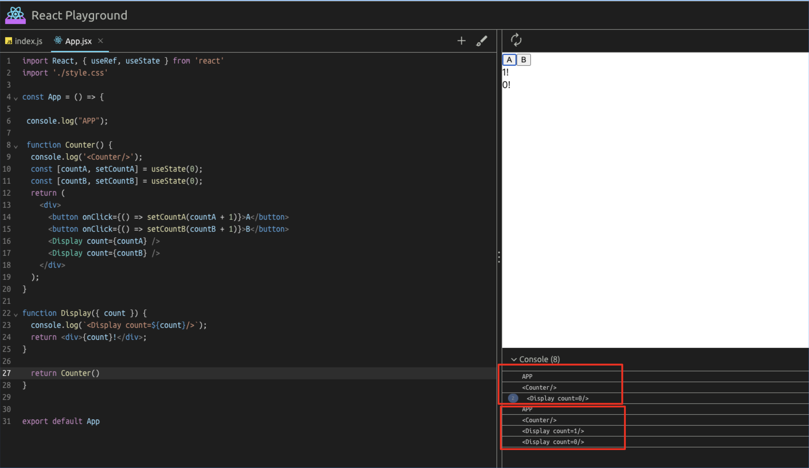
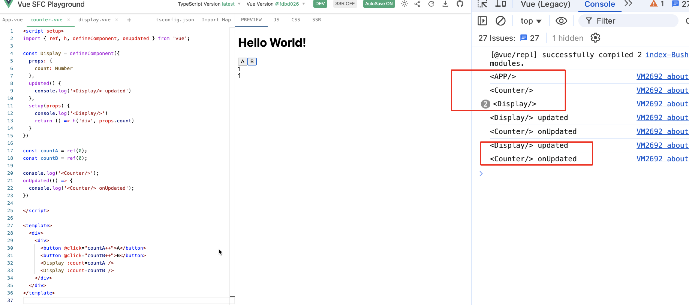
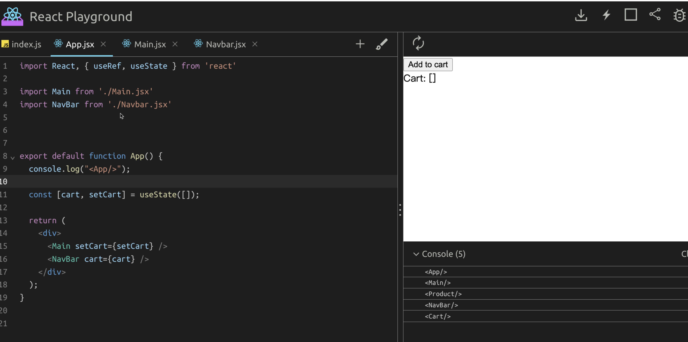

# Signals

## 前言

`useSignal() is the Future of Web Frameworks - Signals` 
`Why Signals Could Be the Future for Modern Web Frameworks?`

最近前端圈内流行的一句话就是，`Signals是前端框架的未来`。
很多框架都有相关的实现：Solid、Angular、Preact、Qwik、Vue等

## Signals是什么？
一种**存储应用状态的方式**，可以在被访问时跟踪依赖、在变更时触发副作用。
在现代Web框架中常用来`实现细粒度订阅和更新渲染`，也就是响应式。

**主张**: 状态以值容器的形式存在，返回状态的getter和setter

```js
const [getCount, setCount] = createSignal(0)

// 读取
console.log(getCount()); // 0

// 赋值
setCount(5)
console.log(getCount()); // 5
```


```js
// React
const [count, setCount] = useState(0)
// 读取
console.log(count); // 0

// 赋值
setCount(5);
```

与常规状态的区别： 返回的状态的getter，而不是直接的状态值。

## 解决了什么问题？

### 减少组件的冗余渲染


因为React useState返回的是一个状态值，无法知道这个值被哪些组件使用，
只能通过setState知道这个状态发生了变更，
不知道对应的哪些组件要更新，只能更新整个组件，
这是一笔不小的开销

而使用Signal的框架，在状态被读取的时候，是会收集调用方作为依赖；
这样在状态变更的时候，能够明确的确定需要更新的组件，这样就可以减少不必要的更新。



可以看到，countA、countB发生变化的时候，精确的找到了需要更新的组件`Counter`和`Display`;
上层的APP组件，并没有受到影响做无谓的更新操作。


状态的含义，分为两个概念
  + 状态的引用，指向状态值的引用
  + 状态值 内存/引用里存储的状态的值
  
读取、设置、传递

可以将`值引用的传递`操作和`读取值`操作区分开来
值引用的传递无法实现类似功能。

**优化方向**: 使用状态引用，在调用getter的时候，收集状态的依赖

### Prop drilling
有些状态需要在不同的组件中使用，
就必须把这个状态提升到这些组件的公共祖先组件层级上，
这样再一层层的传递到具体使用的后代组件中



**有什么问题？**
1. 状态更新时，触发不必要的更新
2. 组件耦合度高，不利于符用，中间的组件需要帮助传递状态到下层，即使自身并不需要这个状态

**Signals如何避免这个问题？**

Signals的创建不依赖于组件，可以抽取出独立的Signals创建逻辑
在组件树的任何层级，按需引用Signals，
避免不必要的传递，也减少了不必要的组件更新。

## Signals如何实现的？
再回顾一下Signals的定义，是一个状态容器，目标是存储状态值，工作内容是在被访问时保存调用者作为依赖；在状态更新时，通知依赖重新执行

因此，Signals的关键就是存储、在读取时依赖保存、在变更时通知依赖。

一个简单的示例如下：

```js
// 一个全局的队列，主要作用是将Signal的读取行为包装成一个统一的函数，作为依赖存储
const context = [];

function createSignal(value) {
  // 依赖存储桶
  const subscriptions = new Set();

  const read = () => {
    // 状态被读取时，收集依赖
    const running = context[context.length -1];
    if(running){
      subscriptions.add(running);
    }
    return value;
  };
  const write = newValue => {
    // 状态变更时 通知依赖重新执行
    for(const sub of [...subscriptions]) {
      sub()
    }
    value = newValue;
  };

  return [read, write]
}

```
关键就在于对状态的读取、更新行为的拦截。

## 拓展
**关于Signals的三个关键概念**:

1. `Signals` 可观察的状态 
2. `Reactions/Effects`，反应/副作用函数，订阅Signals并在Signals值变化时重新执行自身
3. `Derivations/Computed` 派生状态, 在原始Signal的基础上做一些逻辑计算之后的状态，依赖Signals的变化而实时更新

**关于Signals的两个慎重处理的问题**:
1. 依赖关系图谱的建立与清除，因为Signals需要维护使用它的依赖，并且在状态发生变化的时候，通知依赖更新，因此依赖关系必须是实时、准确的，否则就可能导致不必要的依赖更新、或者是必要的依赖没有更新
2. 同步问题，状态的变化必须是同步的，同步才能在单线程的架构下，保证状态的变化是准确、可预测的


## 总结
以上就是关于Signals的一些基本信息，本身并不是一个新的概念，并且实现的思路也并不复杂。
其实，会发现Signals和Vue的响应式数据只是行者孙和孙行者的关系罢了。
