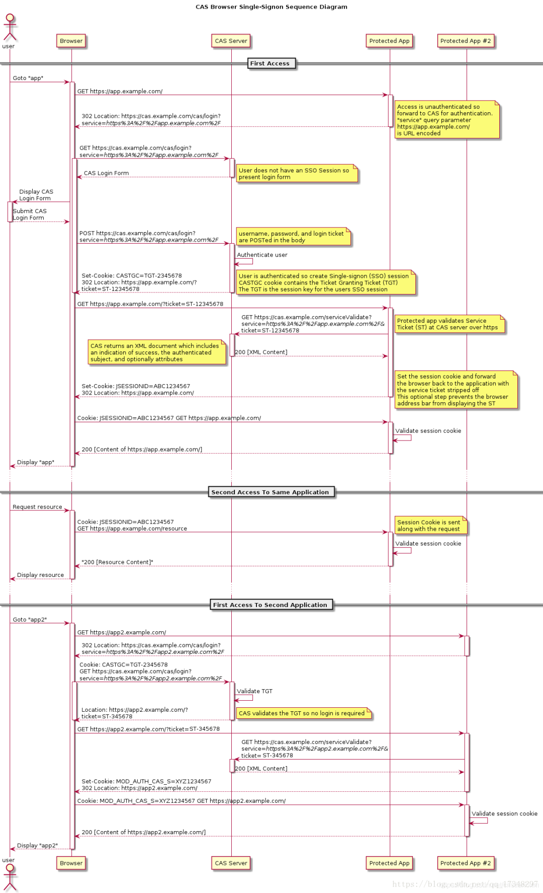

# SSO

Single Sign On 单点登录，用户在多应用系统中，在其中一个应用中完成登录，即可访问相互信任的其他所有系统。

## 核心概念

`cookie`

`token` 用户身份令牌，标识一个用户身份信息，常见的token信息是以cookie的形式存储在客户端。即本质是一段标识用户身份信息的cookie。

## 关键技术点

1. 登录状态共享，一点登录，多点复用
2. token隔离，多个系统之间不是简单的共享token，一方的token泄漏，不会影响到其他系统

## 实现方案

### 单一域名（单一站点）

相互信任的多个系统都是在同一个域名下，可以将cookie种在相同的顶级域名下，这样多个系统之间都会共享这个登录cookie，

优点： 实现简单，前端接入成本低
缺点：没有token隔离；任何站点发生token泄漏，都会影响到其他站点

### 多域名

多域名实现单点登录，就不能简单利用cookie了；因为浏览器安全策略限制，不能跨域操作cookie

业内成熟的方案是，CAS框架（Centrl Authentication Service）
> SSO是一种思想，CAS是实现这种思想的一种框架

主要的思想就是在业务服务器之外，存在一个专门的认证服务；
并且业务服务内接入了登录拦截器，用来分发、验证登录状态。

- 认证中心：独立于业务服务之外的专门的登录认证服务，
- 登录拦截器：与业务服务部署在一起，用来过验证、分发业务请求
- 用户第一次在认证中心完成登录之后，认证中心会产生一个全局会话（类似于令牌的凭证）
- 每个系统都会有对应的各自的局部会话，以此实现token隔离

具体的实现思路是：  

1. 用户访问系统A，拦截器拦截并解析请求，发现没有有效的局部会话，重定向到认证中心；
2. 认证中心监测到用户并没有登录，没有全局会话，重定向到登陆页
3. 用户在登陆页输入用户名、密码完成登录之后，认证中心建立全局会话，`新建令牌A`并重定向到系统A；
4. 系统A发现令牌之后，拿着令牌到认证中心验证，验证通过之后建立系统A的局部会话，以cookie形式存储在客户端，后续以此正常的访问系统A内的资源；
5. 用户访问系统B；拦截器发现没有局部会话；重定向到认证中心；
6. 认证中心监测到有全局会话，`新建令牌B`重定向到系统B；
7. 系统B拿到令牌之后到认证中心验证；成功之后，建立系统B的局部会话，之后可以正常访问系统B内资源

### Q&A

**用户在访问系统B，重定向到认证中心的时候，如何传递的身份信息？**

用户在系统A内完成登录之后，会创建一个全局会话凭证，具体来说就是会在认证中心的域名下种下一个cookie，标示用户在认证中心的身份；当用户在系统B内因为未登录而被重定向到认证中心的时候，会携带上之前种下的标示用户身份的cookie；认证中心根据该cookie会读取出对应的全局会话信息，以此来判断是否建立了全局会话，即是否完成过登录

**如何理解全局会话&局部会话&令牌？**

会话，即session，session就是更安全的cookie， 服务端cookie，本质上是一个id，在服务端内，每一个id都会对应着一段用户信息cookie；
从认证中心完成登录之后，重新跳回到业务站点时，携带了一个叫`令牌`的东西，个人理解有2个作用：

- 更安全的传输信息，不必使session信息以明文传递；
- 认证中心与业务站点通常是在不同的域名下，因为跨域的限制，认证中心无法直接在业务域名下种cookie，因此传递一段类似cookie id的信息（即令牌），业务站点再拿着这段令牌，取换取真正的cookie，并种在对应域名下。

## 单点登出

用户在一个站点登出之后，其他系统内也会自动登出。

1. 用户在站点A发起登出请求
2. 站点A服务销毁局部会话，同时通知认证中心用户登出
3. 认证中心销毁全局会话，同时通知其他系统

认证中心如何通知其他系统？

存在一个缓存系统，该缓存系统内存储着用户的最新登录状态；系统在每次验证局部会话的时候，都会访问该缓存系统，查看该登录状态是否有效，是否已被其他系统所销毁。如果已被销毁，即使局部会话有效，也会被销毁，以此来实现关联系统的登出。

## SSO与OAuth

SSO: Single Sign On 单点登录
OAuth2.0:  Open Authority

### 认证与授权

`认证`： 知道他是谁,必须要有身份提供商， 需要有身份证+凭证
`授权`： 知道他有没有权限对资源执行操作，只要有凭证就行

都是使用令牌的方式来代替用户密码访问应用
OAuth的角色：

- 授权服务器： 提供认证服务的，比如微信、支付宝等
- 客户端： 接入授权服务的各个应用系统，使用者

OAuth2.0 四种模式

- 授权码
  - 三方应用先获取授权码，再在自己的服务端使用授权码获取令牌
    - 获取授权码的方式可以有重定向(微信)或者jsapi(支付宝)
  - 授权码前端获取，令牌存储在后端，安全性比极高
- 隐藏式
  - 没有后端的web服务，授权服务器直接向前端颁发令牌
- 密码式
  - 直接把帐号密码同步给应用
- 客户端凭证
  - 适用于没有前端的命令行应用，在cli模式下请求令牌

OAuth2 是用来允许用户授权第三方应用访问他在另一个服务器上的资源的一种协议，
不是做单点登录，但是类似单点登录

授权服务器往往提供的就是用户在这个服务器内存储的用户信息。
需要用户登录并授权，授权服务器负责令牌的发放和资源的共享。

## 参考文档

[CAS实现单点登录SSO执行原理探究](https://blog.csdn.net/javaloveiphone/article/details/52439613)
