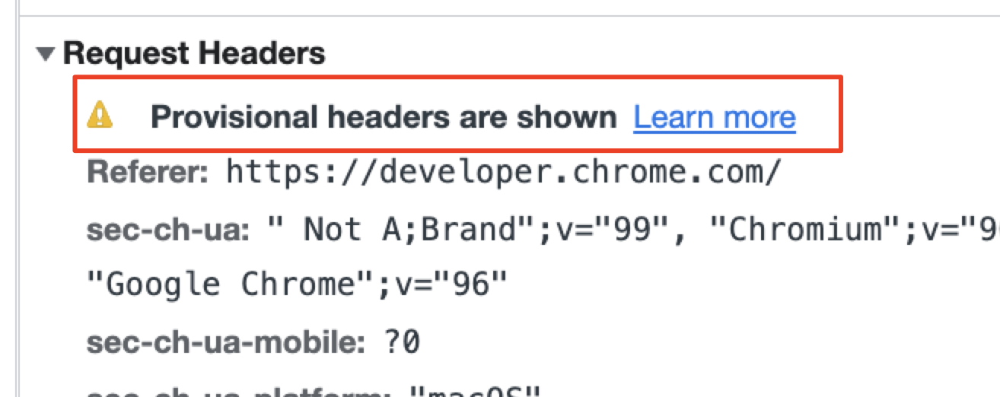

# network

网络相关

## 浏览器

### 浏览器network相关知识点

#### Timming

+ **Queueing** 网络请求开始连接之前，可能会经历排队
  + 如果有更高优先级的请求
  + 当前域名下已经有6个TCP连接，在HTTP1.0/HTTP1.1
  + 浏览器正在为请求分配内存
+ **Stalled** 连接之后，也可能会暂停，原因同上
+ **DNS Lookup** dns 解析
+ **Initial connection**  初始化连接
  + TCP握手 重试
  + 协商SSL
+ **Proxy negotiation** 与代理服务器协商
+ **Request sent** 连接发出
+ **ServiceWorker Preparation**  service worker 初始化准备
+ **Request to ServiceWorker** 请求发送到service worker
+ **Waiting TTFB** 浏览器等待服务器响应的第一个字节
  + 时长包括一个网络来回，以及服务器准备响应的耗时
+ **Content Download** 内容下载， 要么来自网络服务器，要么来自service worker
  + 代表读取响应体需要的时间
  + 如果慢的话，要么是网络差，要么是浏览器忙于其他worker
+ **Receiving Push** 浏览器正接收来自HTTP/2的服务端推送
+ **Reading Push** 浏览器读取上一步接收到的存储在本地的数据

> <https://developer.chrome.com/docs/devtools/network/reference/?utm_source=devtools#timing-preview>

##### curl命令行查看站点各环节连接耗时

```bash
curl -L -w "time_namelookup: %{time_namelookup}\ntime_connect: %{time_connect}\ntime_appconnect: %{time_appconnect}\ntime_pretransfer: %{time_pretransfer}\ntime_redirect: %{time_redirect}\ntime_starttransfer: %{time_starttransfer}\ntime_total: %{time_total}\n" https://www.example.com
```

单位：秒

+ **time_namelookup**: dns解析耗时
+ **time_connect**: TCP建立连接完成 耗时
+ **time_appconnect**: SSL/TLS/SSH 握手、建立连接完成耗时
+ **time_pretransfer**: 文件传输准备开始
+ **time_redirect**: 重定向耗时 包括整个重定向过程：新地址dns解析、TCP连接、SSL连接、文件传输准备
+ **time_starttransfer**: 首字节开始传输 包括文件准备、服务器计算时间
+ **time_total**: 整个过程持续时间， 毫秒精度

time_connect + time_appconnect 可以计算出 SSL/TLS 握手耗时
如果是HTTP连接，time_appconnect 是0

如果没有重定向，time_redirect 是0

> Timing With Curl<https://susam.net/blog/timing-with-curl.html>

## 常见问题

### provisional headers are shown

请求头信息不是真实的



1. 常常发生在**多次网络请求**场景下，并且**开启了缓存**；如果有某次请求没有得到正确的响应，后续的请求又触发了缓存策略，就会出现这个提示
   1. 跨域
   2. 服务端错误，没有正常抛出
2. 还有一种可能是，**请求的资源无效**，这时候网络面板上会有明显红色的错误提示，并且在请求头展示如上信息
