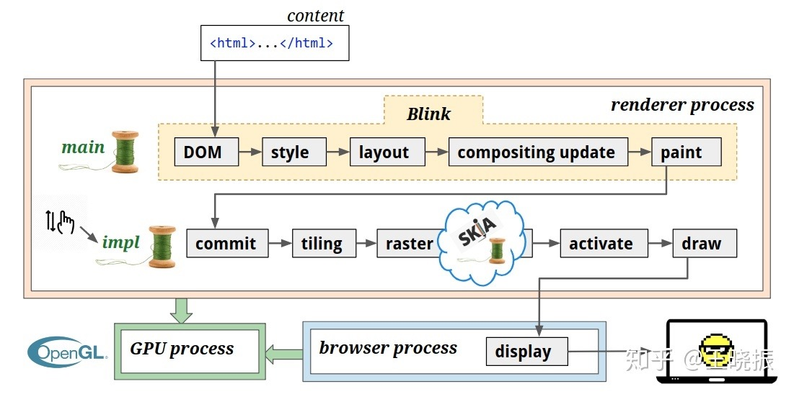

# 渲染流程
**什么是渲染？**
将`web content`转换成`像素点`绘制在屏幕上

web content：页面内容
web content 就是页面中的所有元素，常见的web content
    Html
    css
    js
    images
    video
    canvas
    webAssembly
    webGL
    webVR
    PDF

像素点
影像显示的最小单元，有明确的位置和分配的色彩数值，有一定的面积

> 操作系统提供图形库将像素画到屏幕上，当前绝大多数操作系统使用OpenGL作为图形库的标准API

**渲染的2个目标**
1. 将content转换成像素点
2. 同时产生一个数据结构，方便后续高效的更新
   1. 可能会导致更新的行为有：
      1. js脚本
      2. 用户交互
      3. 异步加载
      4. 动画
      5. 滚动
      6. 缩放

渲染步骤
## 1. 解析
html --> DOM   **产物是DOM树**

HTML代表了页面文档的层次结构；
解析的过程就是将HTML转换成**文档对象模型** DOM

DOM是渲染引擎blink内核中表示页面的内部数据结构
也会暴露给JS引擎；V8对其封装后暴露出DOM web API；即操作的dom的api

## 样式表
处理样式
通过选择器，将css样式应用到对应的DOM元素上

元素可以被多种选择器规则命中，可能会产生样式冲突

浏览器中的样式解析器，会为每个dom元素计算出最终的样式规则
存储在computedStyle中，这是一个大的map

这个map也会暴露给js引擎

## 排版
确定所有元素的显示位置

块元素 block-flow
    按照DOM顺序将块元素依次垂直放置
    块元素高度
        文本高度
            字体 - 换行

最终得到每一个DOM节点LayoutObject
    这个对象与DOM节点并不总是一一对应的
    其中存储着不同的矩形坐标

## 绘制
将需要的绘制操作记录在一个display item list中
一个LayoutObject可能对应多个display item

这个环节并没有真正的绘制，只是在做绘制安排

> 只是确定绘制需要的原子操作
## 光栅化
真正的执行display item list中记录的绘制操作流程

光栅化的产物是`位图`
此时，像素还未显示在屏幕上

> 位图 又称 栅格图 使用像素阵列表示的图像

### 分块
光栅化的输入是一个图层内的所有需要绘制的元素的DI list

某个图层可能比较大，全量绘制的话开销会很大

因此合成器线程会将图层分割成多个块, 分块绘制，分块是光栅化的工作单元

## GPU调用
由于浏览器每一个tab运行在一个沙箱隔离出的进程中
不能直接进行系统调用，就意味着不能直接调用OpenGL渲染

因此会需要ipc调用GPU进程，进行实际的GL调用、渲染

## 动画
DOM --> style --> layout --> paint --> raster --> gpu
经过以上的路程, 内容已经变成了存储在内存中的像素了

不过页面不总是静态的，会有滚动、缩放、动画、动态加载等导致页面发生变化

## 合成
合成做了两件事情
1. 将页面分为不同的图层（主线程）
2. 在另外的线程中将这些图层合并 （合成线程）

动画、滚动、缩放等都是用到了图层的变化与合成
合成图层的好处在于，不会影响主线程的执行，引起卡顿

`图层同样是树形结构`
在确定排版对象的时候，可能会会产生图层
   + 作用域一个排版对象上的特定样式属性会导致该排版对象生成一个新的图层
   + 如果一个排版对象没有直接对应一个图层的话，会被绘制到其最近的拥有图层的祖先节点的图层内
因此在排版和绘制之间，其实还有`图层合成`的一步

DOM --> style --> layout --> **compisiting** --> paint --> raster --> gpu

> 图层合成在绘制阶段之前
> 每个图层独立绘制

## 上传
绘制完成之后， 上传阶段更新合成器线程上的图层树，
保证主线程和合成线程上的图层树保持一致
## 分块
光栅化的工作单元
图层巨大的时候，一次性光栅化会有很大开销；并且图层内不可见的部分不需要光栅化
因此需要分块，合成器线程会将一个大的图层分成多个小块

## 绘画
分块光栅化完成，合成器线程生成 **绘画矩形**    
绘画矩形指的是在屏幕的指定位置绘制一个分块的指令

## 显示
`浏览器进程`运行显示合成器组件,将绘画矩形绘制到屏幕上

显示合成器聚合了来自全部render进程的提交的合成器帧对象，和浏览器自身的UI合成器帧对象；   
然后调用GL指定绘制矩形资源

## references
+ [一颗像素的诞生](https://zhuanlan.zhihu.com/p/55192083)
+ [lifecycle of pixels](https://docs.google.com/presentation/d/1boPxbgNrTU0ddsc144rcXayGA_WF53k96imRH8Mp34Y/edit#slide=id.ga884fe665f_64_262)

### 哪些样式会产生新的合成图层
+ document 默认是一个图层
+ position: fixed
  + position: relative\absolute\sticky 都不会产生新的图层
  + 并且当定位z-index是正值的时候，仅产生自己的新图层
  + 当z-index是负值的时候，会影响html产生一个新的图层，导致出现3个图层
+ backface-visibility: hidden 
+ bix-blend-mode: 非normal
+ will-chang: trasform 设置了will-change属性
+ 3d transform transform： translate3d/translateZ
+ css实现opacity、transform、filter、backdropfilter 动画转换(transition\animation)

GPU加速
GPU是图形处理器，专门处理和绘制图形相关的硬件。
正常情况下，浏览器会智能的对某些元素使用GPU加速，提高渲染性能

开发者可以通过某些手段，对某些元素显示的指定使用GPU加速
1. transform: translate3d\translateZ\ 等，3dtransform
2. will-change： transform、opacity、filter等

谨慎使用
