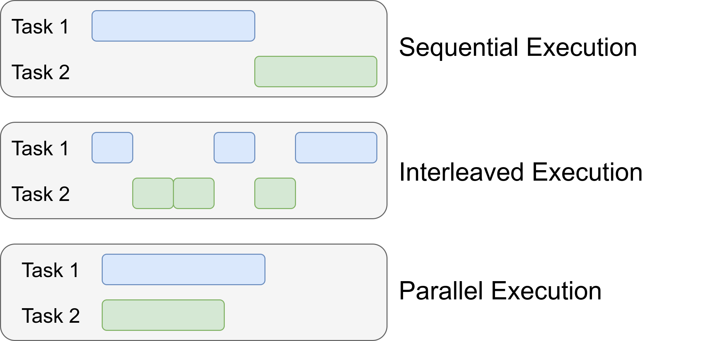

# 串行&并行&并发

+ sequential 串行
+ concurrent 并发
+ parallel 并行

`并发执行`，是多个子任务交替执行，在某一时刻只有一个任务被执行
`并行执行`，是多个字任务同时被执行，在某一时刻，有多个任务被执行

`多线程是实现并发/并行的一种方式`

并发或者并行，是实现多任务的两个途径，对开发者来说体验是一样的，
也就是开发者并不能完全决定是并发还是并行

真正起决定性作用的是硬件设备，看CPU内核数；
如果CPU的内核数，大于或等于需要的线程数，那往往是并行执行；
否则就是并发执行

线程Threads

`派生进程是实现并发/并行的另一种方式`
但是多进程执行任务，进程间的内存数据是相互独立分配的，不能直接共享；
这就涉及到进程间通信，效率并不高

spawn process 派生进程 是什么？
与进程、线程有什么关系？

`I/O Notification 是实现并发/并行的第三种方式`
