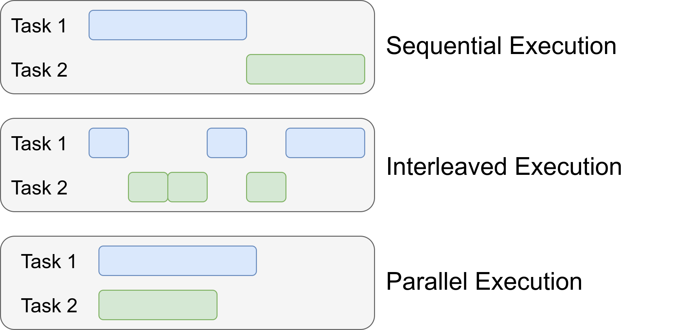

# 串行&并行&并发

+ sequential 串行
+ concurrent 并发
+ parallel 并行

`并发执行`，是多个子任务交替执行，在某一时刻只有一个任务被执行
`并行执行`，是多个字任务同时被执行，在某一时刻，有多个任务被执行

> Concurrency is about `dealing` with lot of things `at once`, Parallelism is about `doing` a lot of things `at once`
>
> Concurrency is the composition of independently executing processes.
> It is about dealing with a lot of things as once. It is about structure. The goal is to structure things so that you could possibly employ parallelism to do a better job. But parallelism is not the end goal of concurrency. When you structure task/things into pieces, you need to coordinate those tasks/pieces with some form of communication. Ref: Communicating sequential processes (CSP) by Tony Hoare.
> Parallelism is the simultaneous execution of multiple tasks/things that may or may not be related.
> Parallelism is about doing a lot of things at once. It is about execution.

`多线程是实现并发/并行的一种方式`

并发或者并行，是实现多任务的两个途径，对开发者来说体验是一样的，
也就是开发者并不能完全决定是并发还是并行

真正起决定性作用的是硬件设备，看CPU内核数；
如果CPU的内核数，大于或等于需要的线程数，那往往是并行执行；
否则就是并发执行

core 和 kernel 的关系

GPU & CPU
CPU有少量的大核心
GPU有大量的小核心

GPU擅长处理并行任务，更注重同时处理大量独立运算，瞬时并行任务
CPU擅长处理并发任务，更注重并发处理多任务调度，随机任务处理

GPU在图像绘制上有优势，因为这种是重复的、独立的像素绘制，人物之间没有依赖关系，GPU更有优势
所以游戏依赖GPU

CPU在系统层面有更大作用，调度处理系统层面的各种随机事件，点击、播放、等

线程Threads

`派生进程是实现并发/并行的另一种方式`
但是多进程执行任务，进程间的内存数据是相互独立分配的，不能直接共享；
这就涉及到进程间通信，效率并不高

spawn process 派生进程 是什么？
与进程、线程有什么关系？

`I/O Notification 是实现并发/并行的第三种方式`
