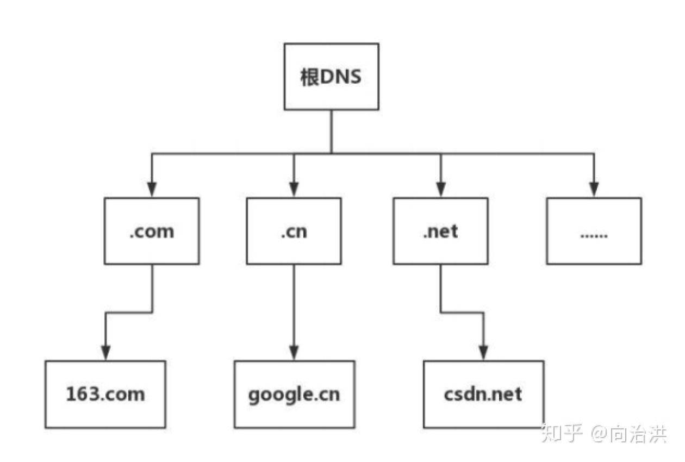
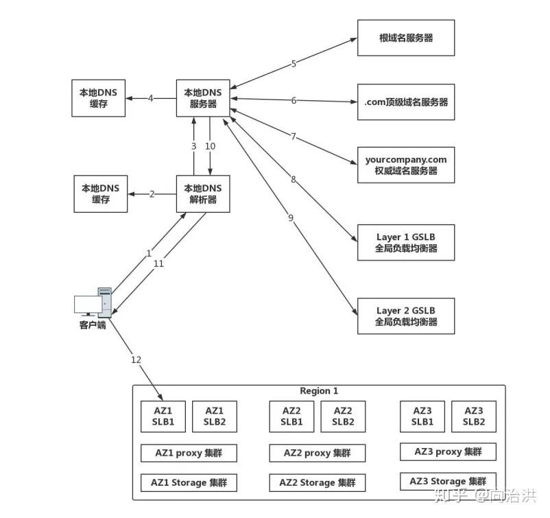

# HTTPDNS

## 什么是DNS

网络通讯大部分是基于TCP/IP协议，需要基于IP寻址

因此需要将主机名转换成对应IP，DNS就是做这个转换工作的

## 传统dns查询

基于UDP协议，查询DNS




### 存在问题

+ 域名缓存
+ 域名转发
+ 出口NAT
+ 域名更新
+ 解析延迟

## HTTP-DNS

客户端不再借助内置的DNS寻址机制，利用HTTP请求直接与DNS服务器交互

绕开了运营商的Local DNS，有效防止域名劫持、提高解析效率

并且DNS服务器获取的是真实的客户端地理位置、运营商信息，从而可以有效的改善精度准确性。

使用HTTP请求获取Domain-IP映射，获得正确IP之后，Client自己组装HTTP协议，避免ISP篡改数据

## DNS over HTTPS

httpdns 是使用明文传输的，DNS over HTTPS将DNS解析的过程加密传输，从而使点啊发那个无法知晓用户访问的站点

## IP直连

IP直连是可行的

需要解决的问题

1. host问题
2. https证书验证问题
3. SNI问题
4. 连接服用问题

## HttpDNS调研

### 微信小程序

微信小程序从基础库`2.19.2`版本开始支持移动解析HttpDNS
安卓微信客户端版本8.0.7及以上
ios微信客户端版本8.0.8及以上

目前根据微信官方统计（2023年1月12日），`2.19.2`版本以下的用户
总体占比`0.66%`
安卓占比`0.57%`
ios占比`0.89%`

### 原生支持配置

1. 在[微信服务市场](https://fuwu.weixin.qq.com/service/detail/00022476b70ac08df25cfcefc57015)选购HttpDNS资源，在服务详情页-介入文档获取`serviceID`
2. 小程序网络调用中，启用`enableHttpDNS`，传入`serviceID`

```js
wx.request({
  url: 'https://webapp.wallet.cashyuan.com:2514',
  enableHttpDNS: true,
  httpDNSServiceId: 'wxa410372c837a5f26',
  success(res) {
    console.log('request success', res)
  },
  fail(res) {
    console.error('request fail', res)
  }
})
```

#### 计费说明

1. 使用服务所产生的费用会按照实际调用服务商接口情况进行计费，定价策略由服务提供方制定，开发者需自行前往微信服务市场进行购买、续费等操作。
2. 微信侧每次代开发者调用服务商接口时，微信侧会进行缓存，缓存策略由服务商返回的 ttl 决定，因此不一定每次调用 request 接口都会产生费用。
3. 若开发者的服务可用额度为0，仍在 wx.request 接口中声明使用服务商提供的移动解析能力时，会触发 fail 回调，请开发者根据回调错误码妥善处理。

### 低版本配置

因为微信小程序请求需要预设域名白名单，并且域名不能使用IP地址，
<font color=red>因此低版本(2.19.2版本以下)无法接入HttpDNS</font>

## QQ小程序

QQ小程序原生不支持HttpDNS

并且QQ小程序请求需要预设域名白名单，并且域名不能使用IP地址，因此
<font color=red>因此QQ小程序无法接入HttpDNS</font>

## H5页面

1. 通过HttpDNS服务商提供的API接口，由web端手动请求相应服务，将域名转换成可用ip
2. 使用ip组装请求

问题点

1. ip证书
2. cookie问题
3. 自己封装重试、缓存机制
