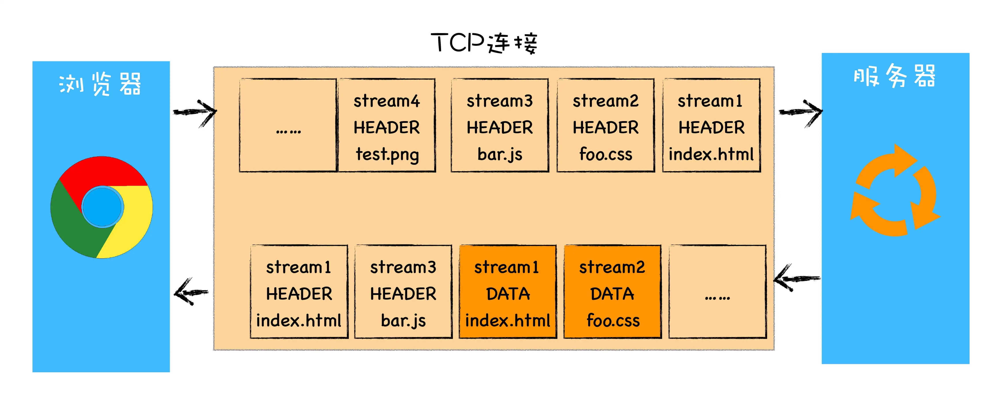

## HTTP版本迭代
1. HTTP/0.9
2. HTTP/1.0
3. HTTP/1.1
4. HTTP/2.0
5. HTTP/3.0

## HTTP/0.9
### 背景
学术交流，专门用来网络间传输HTML超文本内容

### 特性
- 请求只有一个请求行，没有请求头和请求体
- 响应没有响应头，只有数据
- 以ascii码传输

## HTTP/1.0
### 背景
浏览器出现，浏览网页需求，不仅需要传输HTML，
还需要js、css、图片、音频、视频等资源文件

**核心需求**：
- 多类型文件下载

围绕这个诉求
1. 完善了报文结构， 引入了请求头和响应头，用来传递需要的文件信息
2. 响应状态完善
3. 增加了缓存机制，有些资源可以利用缓存提高效率 【浏览器时代开始注重用户体验】

### 特性
#### 引入请求头/响应头
引入key-value形式的报文，用来在浏览器和服务器之间交流请求的信息，包含：
- 文件类型 content-type
- 文件编码 
- 压缩方式
- 语言版本

除此之外还引入了其他的一些机制，用来配合

#### 状态码
服务器告诉浏览器请求处理的结果
（配合不同的状态码）
#### cache机制
减轻服务器压力，缓存资源，毕竟多类型文件下载压力增大

此时缓存用的是：expires&Pragma 
#### 用户代理
服务器统计相关客户端信息，ua字段

## HTTP/1.1
### 背景
针对1.0的一些补充
### 特性
- 持久连接 
    - connection： keep-alive
    - 在一个tcp连接上可以传输多个http请求(但是这些请求是按顺序的处理的，上一个没有完成，不能进行下一个)，只要浏览器或者服务器没有明确断开链接，TCP链接会一直保持
    - 同一域名，默认允许创建6-8给TCP持久链接
> 同一个tcp链接中，需要前面的请求返回后，才能进行下一次请求
> 如果TCP通道内的某个请求因为某些原因，没有及时返回，会阻塞后续的所有请求，这就是**队首阻塞**问题
- 管道化 `pipeline`
  - 管道化是为了解决上述队首阻塞问题
  - 将多个HTTP`请求整批提交`给服务器
  - 虽然是整批发送请求，但是`服务器依然需要根据请求顺序来回复浏览器请求`
- 虚拟主机 host
    - 一台物理主机绑定多个虚拟主机
    - 一个ip对应多个域名
    - host指示请求对应的虚拟主机域名
- 支持动态生成的内容size标示
    - `Content-Length`
      - 在服务器响应的时候，已经明确知道响应文件的大小，放在Content-Length字段内
      - 浏览器根据这个值来接受数据
    - `Chunk transfer` 机制
      - 动态内容case下，服务器在响应的时候是不知道内容大小的
      - 使用Chunk transfer机制，将响应数据分割成任意大小的数据块
      - 每个数据块附上`上个数据块的长度`
      - 最后使用一个`零长度的块`作为数据发送完成的标志
- cookie、安全机制
- 缓存策略完善
    - cache-control 

## HTTP2.0
### 背景
+ 不成熟的管道化无法应用
+ HTTP1.1带宽不能充分利用，限制了传输速率
  + TCP慢启动
    + TCP建立之后，刚开始数据发送速度很慢，然后慢慢加速，直到达到一个理想状态稳定下来
    + 这是TCP为了减少网络阻塞的一种策略，是协议层面的限制，无法改变
    + 通常html、js、css这些文件在TCP建立之后就需要发送获取，但是刚好遇到慢启动阶段，影响页面首屏加载、渲染时间
  + 同时开启多个TCP链接，相互之间会竞争固定的带宽  (多个并发的TCP链接之间资源竞争)
    + 没有优先级，当存在多个TCP链接时，会有并发请求，但是这些请求没有优先级，导致高优资源加载受到影响
  + `HTTP1.1 队首阻塞问题`
    + 同一个域名下，`6-8个并发请求`，指的是`同一个域名下，默认可以创建6-8个持久的TCP连接`
    + `每个TCP管道在同一时刻，只能处理一个请求`，当前请求没有结束，其他请求只能处于阻塞等待状态
    + 意味着不能在一个管道内随意发送请求和接收内容

### 特性
#### **多路复用**   
http1.1 的三个问题中，      
慢启动和TCP连接资源竞争问题，是TCP层面的问题，无法解决
+ 可以规避
+ 每个TCP连接建立时有慢启动，意味着每建立一个TCP都要经历一次这个阶段
+ 可以减少TCP建立来规避，
+ 在HTTP2.0中，只需要建立一个TCP连接，这样整个页面资源的下载只需要经历一次慢启动
+ 同时也避免了多个TCP连接竞争带宽的问题    
 
HTTP1.1 的队首阻塞问题是 HTTP1.1协议导致的
+ `实现了资源并行请求`，是指在同一时刻，可以处理多个http请求
+ 随时可以将请求发送给服务器，不需要等待前面的需求完成
+ 服务器可以随时返回处理好的请求资源给浏览器

一句话总结： **一个域名只使用一个TCP长连接和消除队首阻塞问题**。

**多路复用 - 二进制分帧层**
HTTP2.0 新增了一个 **二进制分帧层**
+ 请求分帧传输
+ 每个请求在经过二进制分帧层处理之后，转换成多个帧数据，每一帧携带有所属请求ID
+ 服务器接受帧数据，按照请求ID信息合并成一条完整请求信息
+ 服务器处理请求，组装响应报文，发送至二进制分帧层
+ 响应报文在经过二进制分帧层处理之后，也是转换成携带请求ID的帧，发送给浏览器
+ 浏览器收到响应帧之后，按照id组装响应信息，提交给对应请求

多路复用是HTTP2.0的核心功能，能实现资源的并行传输(一个TCP长连接中并发处理http请求)
多路复用是建立在二进制分帧层层的基础上的

#### 引入了请求优先级
1. 发送请求时，设置请求优先级
2. 服务器会优先处理高优请求
#### 头部压缩
报文头部压缩
#### 服务器推送
请求一个html文件，服务器自动返回关联的js、css文件，提高了首屏响应速率

## HTTP3.0
### 背景
+ `TCP层面的队首阻塞`仍然存在
+ TCP链接建立时延 RTT
  + 三次握手1.5RTT
  + SSL/TLS 需要1-2个RTT
  + 这是建立tcp连接必需的时延
+ TCP协议硬件僵化

### HTTP3.0 - QUIC 协议
`基于UDP`实现的`多路传输`、`可靠传输`等特性
- 实现了类似TCP的流量控制、可靠传输等特性
- 集成了TLS加密功能，并且使用TLS1.3，减少了握手花费的RTT
- 实现了HTTP2中的多路复用
- 实现了快速握手功能，基于UDP最多需要一次握手

## 补充
### Websocket
HTTP协议的版本更新，主要解决的问题是HTTP协议传输效率的问题；
是在默认**HTTP请求-应答模式**的前提条件下，做的优化；

但是在**实时通信**领域请求应答模式不能很好的满足；因此提出了 **Websocket**

Websocket是对HTTP能力的补充，是与HTTP平级的地位

## 队首阻塞
### HTTP1.1队首阻塞
同一域名下，可以建立6-8个TCP链接；
每个TCP链接同一时刻只能处理一个HTTP请求
当正在处理的这个http请求因为某些原因阻塞了，那么后续的http请求都需要等待
这是HTTP1.1的队首阻塞

### TCP队首阻塞
请求信息在TCP管道中传输时，会被分给成多个有序号的数据包，在接收端按照顺序组装，
如果一个请求中某个数据包丢失，那么整个TCP链接会处于暂停状态，等待丢包重新传输过来

> 在http1.1的时候，一个tcp管道同一时刻只传输一个http请求，tcp层面丢包之后，连接暂停，等待丢包重传，会造成该http请求时延较长，阻塞后面排队的请求; 但是同一时间可能有多个tcp连接，其他连接完成者以后可以继续处理剩余的请求

> 在http2.0，一个tcp管道内有多个请求的数据流，当任意一个数据流中出现了丢包状况，会阻塞管道中的所有请求。 因此当丢包率较高时，http2.0的传输速率反而比http1.1低
