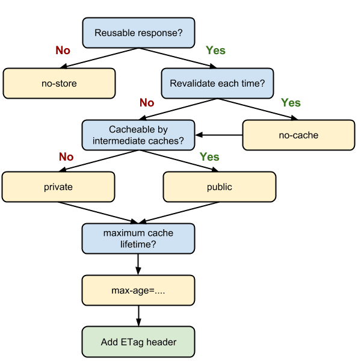

## HTTP缓存策略

### 为什么缓存？

通过网络提取资源既速度缓慢又开销巨大，
体积大的资源在服务器和客户端之间往返，会延迟客户端获得和处理内容的时间，并且会增加访问者的流量。
因此缓存并重复利用之前获取的资源是性能提升的一个关键要素

目前浏览器自带了http缓存实现功能
应用中的webview可能需要额外配置

### 缓存分类

+ `强缓存` `200` 缓存未过期，直接使用`from cache`
+ `协商缓存` `304` 发送请求服务端验证之后缓存未过期，304状态码(携带新的过期时间)，响应报文体为空，使用浏览器缓存

> 缓存验证的可能结果
>
> + `304` 再验证命中 使用缓存资源
> + `200` 再验证未命中  返回新的资源
> + `404` 资源已经被删除，本地接到结果之后也会删除缓存

`协商缓存`，使用`Ctrl + F5`强制刷新可以使缓存无效

`强缓存` 在过期之前，无论怎样都会使用缓存，除非更新资源路径才能发起新的请求。

> 前端工程化中，入口页面`index.html`一般是使用`协商缓存`，每次都必须要向服务端确认缓存有效性，才能使用缓存；缓存无效的话下载新资源；
> `js、css`一般就是使用`强缓存`的，资源文件名加上hash戳，正常情况下强缓存设置很长时间的有效期，第一次请求时下载后续的直接使用缓存；
> 更新的时候资源文件名hash戳改变，相当于改变了资源路径，会重新获取，达到更新的目的

> 这种 `强缓存` + `弱缓存`的策略来最大化的利用缓存资源节约带宽，提高响应速度

### 让一个资源能被缓存

+ `Cache-Control： max-age=duration`
+ `Expires: GMT-time`
+ `las-modified: GMT`
+ `Pragma`

前两种缓存常见，并且优先级递减

第三种属于HTTP规范推荐的启发式缓存，当前两者都没有的设置的时候，浏览器会根据last-modified字段，自发的计算一个缓存周期:
`(Date - Last-Modified) * 0.1`

即本次请求时间与上次修改时间的间隔的十分之一 作为缓存有效期

**强弱缓存的实现**

强缓存和协商缓存的实现是依靠HTTP报文头的一些字段来控制的

+ `If-None-Match` & `ETag`
+ `If-Modified-Since` & `Last-Modified`
+ `Cache-Control:  Max-age = 3600`
+ `Pragma` & `Expires`

前两者是协商缓存
后两者是强缓存

**HTTP1.0缓存控制**

`Pragma: no-cache`;
严格意义上不属于专门的缓存控制头部，
和`Cache-Control: no-cache`一样，强制要求在使用缓存之前，先到源头服务器进行验证

`Expires`: 过期时间点，绝对时间，值是GMT时间，
服务端设置，浏览器会使用本地时间与之做对比，
这样会有**问题**出现：本地时间不准确的话会使缓存过早失效或者延迟失效

`If-Modified-Since & Last-Modified`
服务器第一次响应请求的时候，会在响应头部，设置`Last-Modified: 时间点`字段，告诉浏览器资源上次修改时间；
浏览器下次请求资源的时候会在头部加上`If-Modified-Since： 时间点`字段，
服务器接收到响应的时候，会验证当前资源在改时间点之后是否又做了修改，如果未修改就会返回`304`通知浏览器使用缓存；
如果已修改就会正常返回资源并更新`Last-Modified`值

但是，这个修改时间点只能精确在1s内，如果在1s内多次修改，是无法识别的；
还有就是文件周期性的改变，并未修改内容，但是时间会修改，这样也会导致缓存失效

**HTTP1.1缓存控制**

`Cache-Control: no-store/no-cache/max-age` 专门的缓存控制头部

`Cache-Control: max-age=3600`
服务器设置，设置有效期，
是一个相对时间，浏览器第一次接收到之后开始的一段时间内有效，避免了服务端和客户端时间不一致导致的问题

`If-None-Match/ETag`:
服务器在初次响应资源的时候，会在响应头部添加`ETag: hash`的字段，标示文件的指纹；
每次修改文件指纹都会变；
这样浏览器子啊请求的时候会在头部用`If-None-Match: etag`带上该指纹；服务器接收到请求之后会对比资源指纹，未变化的返回304;
变化的话返回资源文件并更新ETag值。

因为Etag是使用一定的算法根据文件内容得出的hash串，只要文件内容改变就会改变，即使1s内多次变化也能识别出来，没有`last-Modified`存在的问题；

**优先级**

`Cache-Control` > `Expires`

`ETag` > `Last-Modified`

##### 其他缓存相关字段

`Cache-Control: no-store/no-cache/public/private/max-age`

+ `no-store`  禁止浏览器以及所有代理服务器缓存资源
+ `no-cahce`  可以缓存，但是每次必须要先向服务端验证资源的有效性，有效的话返回304，再使用缓存资源 ，避免了资源再次下载
+ `public` 资源可以缓存，不是必须的，比较宽泛，一般会使用更加精细的缓存策略
+ `private` 只为单个用户缓存，不允许任何中间 代理服务器缓存，一般缓存包含私人信息的HTML网页
+ `max-age` 缓存资源的有效期，从请求的时间开始
+ `if-only-cache` 表明客户端只接受已经缓存的响应，并且不需要向服务器校验更新
+ `must-revalidate` 缓存必须在使用之前验证旧资源的状态，并且不可以使用过期资源， 主要强调`过期缓存`使用的规则
  + 过期缓存必须去服务器进行有效性校验才能使用
  + 这个字段感觉像是鸡肋，因为客户端本来就会在缓存失效之后向服务端验证。
  + 但是在缓存代理服务器上，有时候获取不到源服务器的内容的时候或者是显式的设置了可以使用过期缓存的情况下，是会向客户端返回过期时间的，用了must-revalidate之后，这些特殊情况就不行了，不能返回过期并且未经验证的资源了

`Cache-Control: max-age=0, must-revalidate` 含义上等价于
`Cache-Control: no-cache`

### 缓存策略技巧

+ 相同的资源使用统一的url，如果在不同的地址上提供相同的url，将会多次提取和存储这些内容
+ 确保服务器提供验证令牌ETag
+ 确定中间缓存可以缓存哪些资源
+ 为每个资源确定最佳的缓存周期
+ 确定最适合的缓存层次结构
+ 最大限度的减少搅动，对于可能会频繁变动的资源，作为独立的文件提供，避免因为它的改动导致其他资源的缓存过期

##### 200(from cache) & 200(from disk)

+ **memory cache**:
  + 将资源存在运行内存中 RAM，从内存中获取，
  + 量小，速度快， 退出进程被清空
  + 在webkit内核浏览器中，将资源分成了主资源（HTML、下载项）和派生资源（内嵌的img\js\css），
  webkit浏览器中一般会用memory cache来存储派生资源，比如小体积的css、js、以及解码过的图片资源（base64），
  过大的体积的js、css一般也是不会存在内存中的
+ **disk cache**:
  + 将资源存在磁盘中，从磁盘中读取，
  + 量大速度慢，退出进程不会被清空
  + 也是用来存储派生资源的。

`使用策略`

+ **资源大小**
  + 小资源可能会存在`memory cache`，大的一般会在`disk cache`
+ **使用频率**
  + 高频使用的会存在`memory cache`， 低频使用的会使用`disk cache`
+ **资源类型和使用方式**
  + 不常变化的图片、script、style文件，一般会使用disk cache
  + 下一个session要使用的，或是会重复获取使用的，一般会使用memory cache

### 判断是否是缓存获得

HTTP是没有为用户提供一种手段来区分响应是缓存命中还是网络请求

有些商业代理会在Via首部附加一些额外信息来描述缓存命中的情况

客户端可以使用Date首部来判断响应是否来自缓存：Date值小于当前时间的话，就可以认为这是一条来自缓存的响应

### Service Work Cache (线程缓存)

可以缓存HTTPS请求，只能是HTTPS，不能是http请求

使用 cache 来缓存内容

### Push Cache

HTTP2在server push阶段存在的缓存

+ 只有在`memory cache`、`http cache`、`service cache`均未命中的情况下采取查找`push cache`
+ `Push Cache`是一种session级别的缓存，当session终止的时候，也会被销毁
+ 可以共享，不同页面共享了一个HTTP2连接，就可以共享其中的`push cache`
