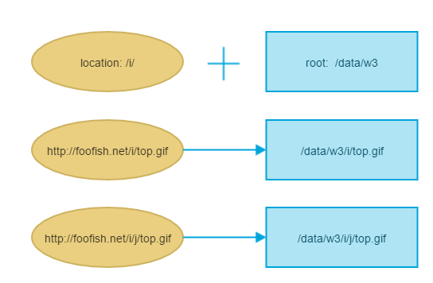
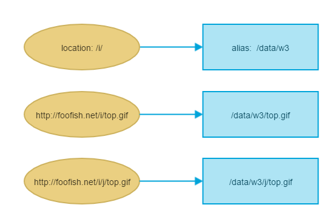

# 上下文

+ main
+ http
+ server
+ location

## 三层配置

nginx 文件一般是在 `/etc/nginx` 路径下

主配置文件是 `nginx.conf`

主要配置信息有三层：
优先级由低到高： http < server < location
优先级高的层级同名配置会覆盖低层级的配置

+ http用于配置NGINX全局配置
+ server会根据配置中的`server_name` 和 `listen`响应不同的域名和端口的请求
+ location用于匹配响应不同的请求路径

一般是会对每一个站点host，新建一个server配置文件，将这些配置文件集中在一个目录下，然后将所有的配置文件引入。

```bash
# nginx.conf 
http {

    # 在文件末尾
    include path/to/conf_dir/*.conf;
}

```

### 通用配置

可以在http、server、location三个配置块内多次出现

+ root 标识匹配的访问的资源所在的根目录
+ alias 需要重定向文件地址的时候会用到，类似root
+ index 没有具体的访问路径时，默认返回的文件

### http

在http模块中会引入server模块的配置，
一个比较好的实践是，创建一个server配置文件的软链，在http中引入的是server配置的软链；而不是真正的配置文件
> Debian 和 Ubuntu的默认实践

这样做的好处在于网站废弃或者暂时不用了，只需要删除软链即可，不需要修改配置文件。

```bash
mkdir /etc/nginx
cd /etc/nginx/

```

http请求的入口

### server 配置

server_name 是用来匹配 请求的host字段
port 是匹配请求的端口

> https 配置规则？？？

server 匹配规则

+ 精准匹配
+ 前通配符匹配
+ 后通配符匹配
+ 正则匹配
+ default_server 匹配

优先级由高到低

### location 配置

location规则是用来匹配请求的`path`，
nginx location 将请求抽象为`对特定文件或文件夹的访问`，
根据不同的location配置，决定返回给请求指定的 response header和 response body.

location 匹配规则

```bash
location optional_modifier location_match {

}
```

optional_modifier 有如下几种取值

+ 空: 不指定  此种状况下， location_match将作为一组请求的匹配前缀
+ =:  此种状况下，需要path === location_match, 完全匹配
+ ^～: 如果location_match满足，则直接使用这个location规则，不再继续进行查找
+ ～:  将location_match作为区分大小写的正则表达式，来匹配path
+ ～*: 将location_match作为不区分大小写的正则表达式，来匹配path

```bash
# 纯前缀匹配
location /api {
    # 会匹配以/api开头的请求， /api, /api/v1, /api/v2, /api/user
}

# 精准匹配
location = /api {
    # 只会匹配/api 不会匹配/api/v1等其他的
}

location ^~ /foo/bar {

}

# 大小写敏感
location ~ \.(jpe?g|png|gif|ico)$ {
    # 会匹配以jpg、jpeg、png、icon结尾的图片资源，不会匹配*.PNG
}
# 大小写不敏感
location ~* \.(jpe?g|png|gif|ico)$ {
    # 会匹配以jpg、jpeg、png、icon结尾的图片资源，以及对应的大写字母
}

```

location 匹配详细规则

1. 在匹配到的合适的server内
2. 找出所有的前缀location（非正则表达式的，包括`optional_modifier为空和=`），将请求uri与location逐一匹配
3. 首先会找使用了`=`的location，如果有符合条件的，请求会直接响应，返回给客户端
4. 如果没有符合的=location；会寻找最长前缀匹配
   1. 如果一个最长前缀使用了`^~`，nginx会直接停止搜索，使用这个location处理请求
   2. 如果最长前缀没有使用`^~`，会缓存该最长前缀规则，开始进行正则表达式匹配
5. 进行正则表达式类的规则匹配，包括大小写敏感和不敏感的，如果有任意一个正则表达式的location能够匹配第三步暂存的最长前缀；那么会将该规则存储在正则表达式队列的最前面；当所有正则表达式搜索完毕，将会水用队列的第一个location规则
6. 如果没有复合条件的正则location，则会使用第三步暂存的最长前缀location

> `^~`与最长前缀配合使用
> 正则表达式也是在最长前缀匹配的基础上的，再次进行匹配

### location 后面带不带/的影响

```bash
location /foo/ {

}

location /foo {
    
}
```

#### root & alias

root 和 alias 都是用于指定资源寻值的路径，确定在哪个目录下寻找资源

root 是直接 使用`root值 + uri`作为完整的资源路径；
alias 是 `alias值 + 资源名` 作为完整的资源路径，真正请求uri中匹配location的部分会被丢掉

> 并且`alias`必须要以`/`结尾；

```bash
location /location {
    alias /path/to/file/  # 匹配的路径下的资源，是直接在alias值 + uri中去掉location剩余的path 才是最终的资源路径
    root /roo/path/ # 匹配的路径下的资源，需要在前面拼接上root前缀，才是资源完整的路径
} 


location /i/ {
    root /data/w3; # 资源寻找路径 /data/w3/i/top.gif;
}

location /i/ {
    alias /data/w3/images/; # 资源寻找路径 /data/w3/images/top.gif  中间路径/i就没有了
}
上述 两个配置 ，针对资源请求 /i/top.gif，最终寻值的路径是不一样的
```

> 官网建议，当location匹配的是资源名的话，最好使用root

在root配置下：


在alias配置下：


#### index

当匹配的location规则内没有找到合适的资源，会默认返回的资源

#### try_files

检查匹配项下资源的存在，并且把第一个存在的资源作为响应返回给请求方, 如果没有找到符合条件的资源，最后一项会作为重定向的值，进行一次内部跳转。

仅仅对当前location上下文生效

文件资源的寻值，需要结合`root`和`alias`指令，得到最终的资源路径

可以是文件，也可以是目录，目录必须以`/`结尾

```bash
location /images/ {
    try_files $uri /images/default.gif;
}

location /images/default.gif {
    expires 30s;
}
```

#### rewrite

```bash
Syntax: rewrite regex replacement [flag<last|break|redirect|permanent>]

```

该指令可能出现在server配置块或者是location配置块；
regex 匹配的是请求uri,  会按照出现的顺序，依次处理，但是flag的值可能会改变这个行为。

#### error_page

```bash
Syntax: 
    error_page errorCode [=[response]] uri;

    error_page 404             /404.html;
    error_page 404 =200        /empty.html;
    error_page 500 502 503 504 /50x.html;


```

error_page 与try_files 类似，处理一些特定错误码出现时的状况，可以内部重定向到一个指定的资源
如果使用了`try_files`就不需要再使用`error_page`; 因为`try_files`可以处理对应的状况

> `try_files`已经设定了资源找不到的降级方案，可以cover全部错误的状况；`error_page`的话，感觉是提供了针对某些错误状况，做针对性的处理的一种手段。

## 自定义变量

### set 指令

syntax

```
# 可以在http、server、if 上下文中
set $var value

# 将value的值设置给var变量，value可以是纯文本、其他变量，或者是文本和变量的组合
```

### map  指令  

在`http`配置上下文内定义
创建一些依赖其他变量的变量，有点类似`computed`的意思

```bash
map $http_user_agent $mobile {
    default       0;
    "~Opera Mini" 1;
}

# $mobile 是创建的新的变量，它依赖于$http_user_agent的值
# 默认是 0；
# 当$http_user_agent的值，匹配正则/~Opera Mini/的时候，值是1；

```

map块内是原始值匹配规则 和 结果值的映射关系；
原始值匹配规则可以是；

+ string 忽略大小写
+ 正则表达式，必须以`~` 或者 `~*` 开头，分别代表区分、不区分大小写

多重匹配规则优先级：

1. 纯字符串匹配，没有通配符
2. 最长前缀通配符 `*.example.com`
3. 最长后缀通配符 `example.*`
4. 第一个符合的正则表达式，按照在配置文件内声明的顺序
5. 默认值
6. 空字符串

## 实战场景

### 单页应用网站配置

### 反向代理

### webp 与 jpg 自动匹配

## 在vscode开发

安装remote ssh插件
`Remote-SSH` 和 `Remote - SSH: Editing Configuration Files` 2个插件

安装完成之后，点击左侧`Remote Explorer`面板上

点击SSH TARGETS 右侧的加号，弹出框中 输入登陆命令: `ssh root@ip`

选择一个配置文件，开始连接

连接成功之后，在左下角可以看到连接的机器信息

点击左侧的`Open Folder`按钮, 在路径栏输入要打开的文件地址，比如nginx配置文件地址： `/etc/nginx`, 就可以打开远程机器上的文件

安装`NGINX Configuration` 和 `nginx-formatter` 可以对nginx配置文件有高亮显示效果，和格式化。
