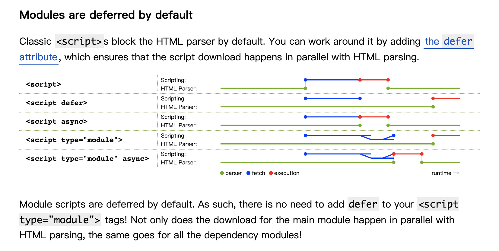

# ES Module

ECMA 官方的module规范
替代commonjs、AMD等其他非官方的模块规范

允许将复杂的逻辑拆分成功能单元，每个功能单元支持`引入`、`导出`一些东西, 这每个功能单元就是一个module

## features

1. 模块内默认使用`strict`模式
2. 每个模块的作用域是独立隔离的，模块内的顶级变量声明并不会挂在widnow上
3. 模块内`this`是`undefined`，要想使用`window`需要使用`globalThis`
4. 模块内，await 可以不在async函数内使用整个模块默认是一个async函数

## 浏览器相关

### 使用

```html
<!-- 优先尝试直接引入esm 不支持的话再fallback -->
<script type="module" src="main.mjs"></script>
<script nomodule defer src="fallback.js"></script>
```

### 相关特点

1. 多次引入同一个模块，模块只会执行一次
   1. 在非module模式下，多次引入一个js文件，文件会被多次执行
2. 模块和依赖是以cors的形式加载的，会有跨域问题
   1. 这个地方是说，在html中直接引入module，浏览器会发起一个http请求，去获取对应的模块，如果模块的路径是在线资源，会有跨域问题
   2. 模块之间的依赖引入，也是以http请求的形式获取的
3. script的async属性，会使对应文件异步下载不阻塞html渲染，但是下载完成会立马执行
   1. 该属性在原来非module模式下，仅适用于加载外部js，对内联js无效
   2. 但是在module模式下，对内联js模块也是有效的

## Module Specifier

模块标识符

在引入模块时，传入的参数，必须是是路径信息，相对的、绝对的、或者完整的
但是不能是模块名，这种叫做 `bare module` 裸模块

## 模块加载机制

esm 加载机制 默认是defer模式，模块及其依赖的模块都是按照这个机制来的；

可以通过手动设置async属性，来实现下载完成后，立马执行



## 动态加载

es module 规范中还支持动态模块加载，允许仅在需要时加载模块，而不是预先加载所有模块
常对首屏性能优化有很大提升

### 用法

允许将`import`当作函数 来调用，接受模块路径作为参数，返回一个promise

```js
import('path/to/module')
  .then(module => {
    // module 变量对应模块对外暴露的内容
  })

```

## import.meta

提供当前的模块的metadata
在不同js运行时获得的信息不一样

## 当前的建议

1. 继续使用bundler
2. 打包和非打包的权限，视项目代码规模而定
3. 使用细粒度的模块
   1. 仅引入使用的模块，细粒度的划分可以不需要使用tree-shking
   2. 不必浪费资源下载不需要的

## preloadmodule

对模块及其依赖，预加载、预解析、预编译

并且节省浏览器对模块依赖的遍历寻找

## http2.0

+ 多路复用
+ server push

## es module 未来新特性

1. 更快、更准确的模块定位算法
2. worklets 和 web worker
3. import maps
4. native bundle
5. layered api
