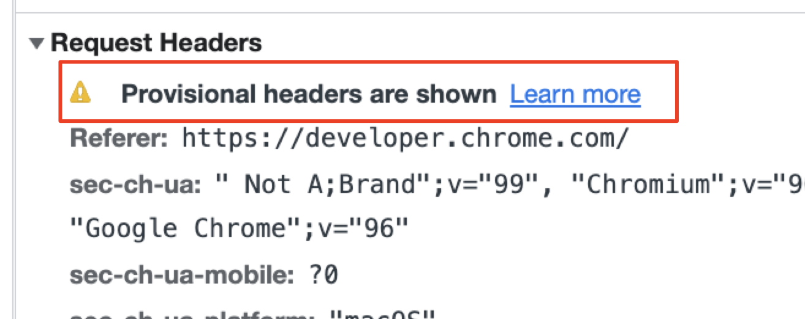

### provisional headers are shown
请求头信息不是真实的

1. 常常发生在**多次网络请求**场景下，并且**开启了缓存**；如果有某次请求没有得到正确的响应，后续的请求又触发了缓存策略，就会出现这个提示
   1. 跨域
   2. 服务端错误，没有正常抛出
2. 还有一种可能是，**请求的资源无效**，这时候网络面板上会有明显红色的错误提示，并且在请求头展示如上信息
