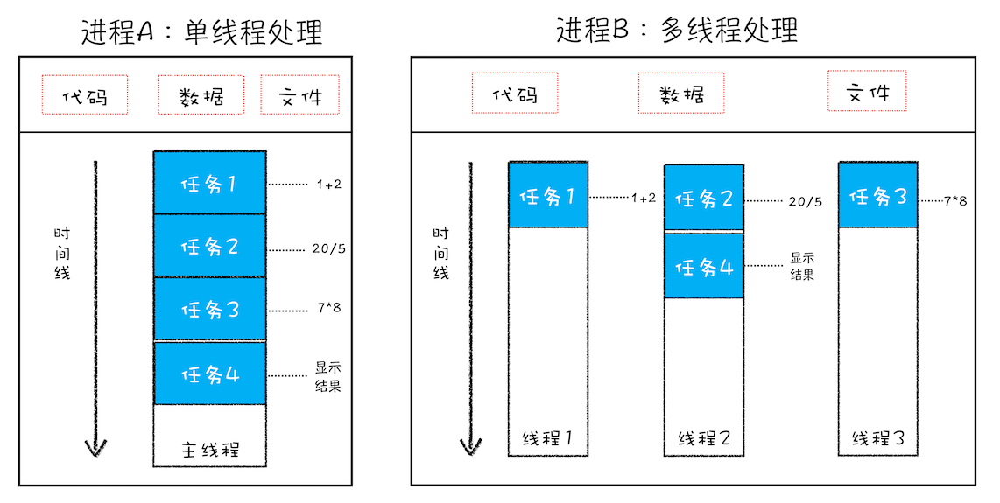

# 进程和线程
进程： Process
   操作系统分配资源的最小单位，伴随着内存分配
   cpu在不同的进程间切换，某一时刻，cpu只能服务于一个进程；进程间的切换是比较昂贵的
   不同进程之间，是相互隔离的，内存空间

线程： Thread
   程序的最小执行单元
   是进程内的概念，一个进程内有一个或多个线程
   同一进程内的不同线程，共享进程的公共资源，包括内存、代码片段、文件资源等

## 进程和线程关系
1. 进程中有1个或多个线程
2. 任意一个线程出错，都会导致进程崩溃
3. 线程之间共享进程的数据
4. 进程关闭之后，会回收内存
5. 进程之间相互隔离，不能直接做数据交互
   1. 进程通信使用IPC
## 多进程和多线程
多进程 multiprocess
   同一时刻，操作系统可以处理2个以上的进程；比如听着歌敲代码
多线程 multithreading
   在同一个进程内，可以并行的执行代码；同时处理多个任务

### 并行处理
计算机中的`并行处理`：同一时刻处理多个任务

计算机中的任务是在`线程`中处理的

因此`能够并行处理多个任务的一定是多线程`；反之是`单线程`

但是`线程不能单独存在，是依托于进程存在的, 线程是由进程启动和管理的`。

一个进程就是一个程序的运行实例；
启动的时候，操作系统会为进程创建一块内存，用来存放代码、运行中的数据、和执行任务的主线程

## 浏览器
浏览器的主要任务
1. 渲染  webkit内核、blink内核； 将`web content`渲染成像素绘制在屏幕上
2. 执行  V8引擎； 解析处理js，处理用户的交互行为
## 浏览器多进程架构
打开浏览器，有4类进程
1. Browser Process 浏览器进程
   1. 浏览器主进程
   2. 控制浏览器整体的显示、隐藏，以及用户交互，比如前进、后退等
   3. 控制浏览器tab页的生命周期，开启、关闭；伴随着其他进程的创建、销毁
   4. 控制用户界面绘制
   5. 控制网络资源的获取，下载等
2. GPU Process GPU渲染进程
   1. 用作3D CSS绘制
3. 网络进程
4. Browser Rendering Process 浏览器渲染进程 内部多线程
   1. 每打开一个浏览器tab都是新开一个进程
   2. 排版引擎blink、js引擎V8
   3. 在这个进程内，主要功能是页面渲染、代码执行、event handling
   4. 并且这个进程是运行在沙箱内的
5. 插件进程

### 浏览器为什么要多进程
1. 多个tab页共用一个进程，任意一个页面crash都会影响其他的页面
2. 同一个进程内，所有线程共享存储空间，会引起安全问题
3. 插件容易crash，单进程会影响稳定性

### 渲染进程
内部是**多线程架构**，主要有
1. GUI Rending Thread
   1. 负责渲染页面，解析HTML、css、构建dom tree、渲染树、layout、drawing
   2. repaint reflow
   3. 渲染线程和js 引擎线程是相互独立的，并且`互斥`; 一个执行的时候，另一个被挂起
   4. js 引擎执行的时候，gui的改动会被暂存，等待js引擎空闲的时候再立即执行
2. JS Engine Thread
   1. js 内核
   2. 负责处理js程序代码；包括代码的解析、执行
   3. 只有唯一一个，js代码只能在这个线程被处理和执行，因此有`单线程`的说法
   4.  如果js引擎执行代码时间过长，会影响页面渲染，造成卡顿
3. Event Trigger Thread
   1. js 引擎处理的事同步任务，异步任务无法正常处理；浏览器新起了一个线程来协助js引擎线程处理异步任务； 核心是`Event Loop`
   2. 遇到异步任务， 对应的回调会被存储在该线程；等时机成熟放入主线程的事件队列
      1. js代码内的setTimeout
      2. 用户交互，点击、鼠标事件等
      3. 异步请求等
4. Timing Trigger Thread
   1. 计时任务不能放在主线程，浏览器单开的一个线程
   2. setInterval\setTimeout
   3. 标准中指定最小的计时片段时`4ms`
5. Asynchronous Http Request Thread
   1. 请求创建连接之后，该线程开始工作
   2. 监听状态变化，将回调函数在合适的时机推入到任务队列

### 单线程
**js是单线程**
完整的来说，**js的执行是单线程的**
同一个渲染进程内，不同线程之间共享资源；
假设多线程执行，对于同一段代码，多个线程有多个处理结果，谁是标准的？
会产生冲突问题

因此需要单线程、并且未来也是

**js存在真的线程的东西**，`SharedArrayBuffer`

### Event Loop
JS 引擎往往不是独立运行的，一般是工作在一个宿主环境（运行时）
web 开发常见的宿主环境有： web浏览器、node

js单线程执行，导致处理异步任务的时候，不能挂起等待任务结束再继续执行；这样会导致页面卡顿
因此宿主环境提供了一个机制，**处理异步任务**，这个机制就是`Event Loop`

js引擎没有主动意识，是一个响应式的机制，任务调度是宿主环境来安排的； 这个任务调度是`event triggered thread`

#### web worker
js单线程执行，在遇到大计算量、耗时的任务（同步任务）时，会导致引擎被长时间占用，不能及时更新用户界面或者处理用户交互行为，造成卡顿现象

不能并行的处理任务，提高效率

因此提出了**worker**的概念，是在系统在主线程之外创建的一个独立线程；
用来处理那些与主线程没有依赖关系、计算量大、耗时的任务；
能与主线程进行通信，在执行完成之后，将结果通知给主线程处理

web worker 创建一个新的系统级别的线程
他可以执行js代码、发起网络请求；但是不会对主线程和渲染线程造成影响
可以与创建他的脚本做数据交互

> 关于worker详见 [workers](./workers.md)

### 为什么说DOM操作耗费性能？
1. 渲染和执行互斥， 当DOM更新需要页面渲染的时候，是会挂起执行引擎的；反之亦然；这种上下文切换耗费性能
2. DOM操作设计重绘重排的时候，需要页面布局做大量的计算，相应的耗时也会增加，影响js执行，造成页面卡顿的现象

